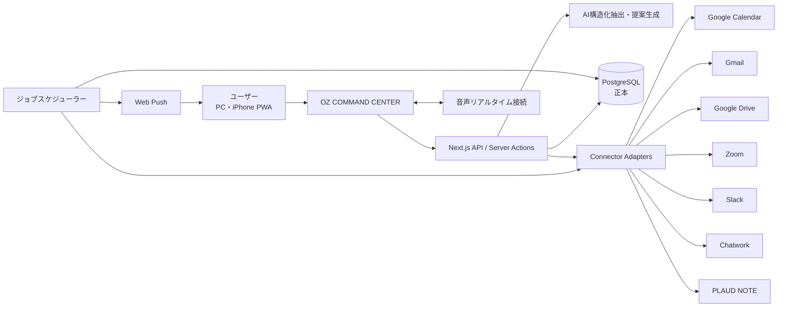
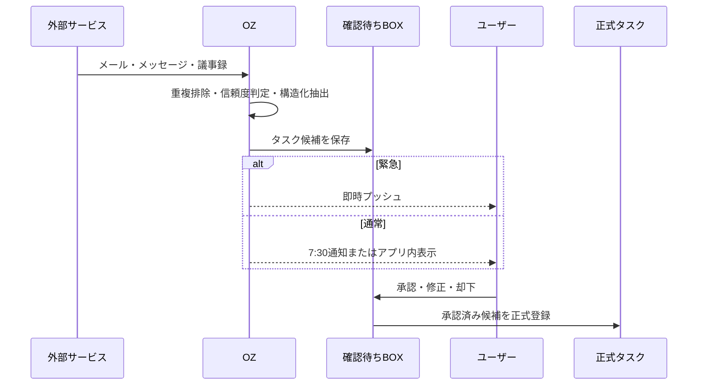
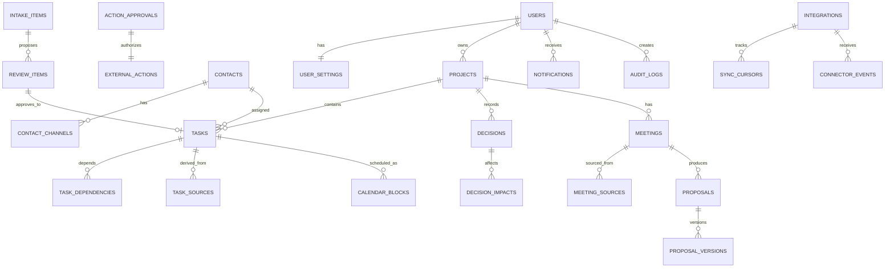

# OZ COMMAND CENTER 開発仕様書 v2.0

- 作成日: 2026-08-23
- 対象: OZ COMMAND CENTER 本体、タスク管理、音声対話、予定最適化、外部サービス連携
- 仕様の優先順位: 本書で「確定」と記載した内容 > 既存画面・既存スケジュール仕様 > 実装時の補助判断
- 既存資産:
  - `OZ_COMMAND_CENTER_v1.0_STANDALONE.html`
  - `oz-command-center-standalone.html`
  - `AI_schedule_management_development_spec_v1.0.md`

---

## 1. この仕様書の結論

OZ COMMAND CENTERは、会話を入口にして、タスク・予定・連絡・資料・商談後の仕事を一つにつなぐ、ユーザー専用のAI業務司令室とする。

既存のOZ画面はデザインの土台として残し、デモ用の固定データと固定シーンを、実データ・音声会話・承認カード・外部サービス連携へ置き換える。PCでは現在の3カラム構成を活かし、スマートフォンでは音声中心の4タブ構成に再配置する。

OZの基本原則は以下のとおり。

1. タスクの正本はOZのデータベースとする。
2. Googleカレンダーは予定と、承認済みの作業時間・移動時間を保持する。
3. Gmail、Slack、Chatwork、PLAUD NOTE、Zoom、Google Driveは情報源または実行先であり、OZの承認ルールに従う。
4. 外部への送信、予定変更、ファイル移動は、OZが案を作り、ユーザーが承認してから実行する。
5. OZがタスク候補を見つけても、原則として確認待ちBOXに入れ、承認後に正式タスクにする。
6. OZの一人称は、音声、チャット、画面、通知、資料のすべてで「私」に統一する。「俺」は使用しない。
7. すべての重要な変更には履歴を残し、失敗時に再実行できる設計とする。

本書では、最初に使える中核部分を「Core Release」、外部連携まで含めた完成目標を「OZ v1」と呼ぶ。後半の機能も削除対象ではなく、実装順を分けるだけである。

---

## 2. プロダクトの目的

### 2.1 解決する課題

- 複数プロジェクトのタスクが会話、メール、チャット、議事録、頭の中に分散する。
- 期限だけではなく、空き時間、作業量、移動中にできるかまで見ないと今日の計画を決められない。
- 人に任せた仕事と返事待ちが抜けやすい。
- 初回商談後の議事録、提案書、価格、フォロー連絡が別々の作業になる。
- 過去の決定や変更理由が残らず、価格・期限・仕様変更の影響範囲が分からなくなる。
- スマートフォン移動中に、会話だけで仕事を前に進めたい。

### 2.2 成功状態

ユーザーがOZに話しかければ、OZが状況を整理し、必要な確認を一つずつ出し、承認された内容をタスク・予定・資料・連絡へ反映できる。毎朝7:30に、その日の予定、絶対にやる3件、作業時間、返事待ち、任せられる仕事、確認待ちを一つの通知から確認できる。

### 2.3 対象ユーザー

- 初期: ユーザー本人のみ
- 認証: 許可されたGoogleアカウント1件
- スタッフ: 初期はログインさせず、Slack・Chatwork・メールで連絡する
- スタッフ用画面・アカウント: 後続リリース

---

## 3. 確定済みの基本ルール

| 項目 | 確定仕様 |
|---|---|
| OZの一人称 | 「私」 |
| タスクの正本 | OZのPostgreSQLデータベース |
| タスク状態 | 未着手・進行中・返事待ち・保留・完了 |
| タスク作成 | 会話または外部情報から候補を作成し、確認カードで承認後に正式登録 |
| 外部操作 | OZがプレビューを作成し、ユーザー承認後に実行 |
| 朝の通知 | 毎日7:30、Asia/Tokyo |
| 通常の通知停止 | 24:00〜7:30。緊急通知のみ例外 |
| 通常の作業提案時間 | 8:00〜24:00 |
| 深夜作業 | 絶対に必要な場合のみ、理由・必要時間・翌日影響を提示して提案 |
| 今日の選定 | 期限、重要度、推定作業時間、Googleカレンダーの空き、依存関係、移動中の実行可否を加味 |
| プロジェクト進捗 | OZが管理する対象タスクの完了数 ÷ 対象タスク数 |
| カレンダー登録 | ユーザーが登録を指示した場合、またはOZの提案を承認した場合 |
| 移動時間 | 前後予定と場所から提案し、承認後にGoogleカレンダーへ登録 |
| Gmail等からの抽出 | 確認待ちBOXへ自動格納。緊急のみ即時通知 |
| 見積もり | 独立ファイルにせず、提案書の価格・プラン章へ統合 |
| 提案書 | 編集可能、バージョン履歴保持、承認後にPDF化・送信 |

---

## 4. スコープとリリース定義

### 4.1 Core Release

最初に日常利用を開始できる状態。以下はすべて必須。

- Googleアカウントによる単一ユーザー認証
- プロジェクト・タスク・サブタスク・依存関係の実データ管理
- 既存デザインを使ったPC画面
- スマートフォン用PWA画面
- テキスト会話と音声会話
- 会話からのタスク候補作成と確認カード
- 今日のタスク選定、絶対にやる3件、任意タスク、委任候補、返事待ち
- Googleカレンダーの予定・空き時間表示
- 作業時間と移動時間の提案、承認後のカレンダー登録
- 毎朝7:30のサマリー生成
- 通知・ジョブ・監査ログ・失敗時再実行の基盤

### 4.2 OZ v1

Core Releaseに加え、以下を本番利用できる状態。

- Gmailからのタスク候補抽出
- Slack・Chatworkからのタスク候補抽出
- Google Drive内の資料検索
- Zoom URL発行と既存URLの重複防止
- 人に任せたタスクの連絡案・催促案・返答状況管理
- 期限前の作業量を考慮したリマインド
- PLAUD NOTE、Zoom、Drive、アップロード、貼付テキストからの議事録取込
- 議事録からのタスク候補登録
- 初回商談からの提案書作成
- 提案書の修正、PDF化、メール案、承認後送信
- 3営業日・7営業日の商談フォロー
- アイデアBOX
- 決定ログと変更影響分析
- メール・メッセージ送信の承認実行

### 4.3 後続リリース

- スタッフ用ログイン・担当者ポータル
- 権限別画面
- 複数企業・複数テナント
- 承認不要の完全自動実行モード
- 作業時間重み付きの進捗率

完全自動実行は、OZ v1の操作履歴と誤実行率を評価した後に、操作種別ごとに許可する。初期状態では有効にしない。

---

## 5. システム構成

### 5.1 推奨構成

- フロントエンド兼API: Next.js App Router、TypeScript strict
- UI: React、Tailwind CSS、既存OZデザイン資産
- データベース: PostgreSQL
- ORM・マイグレーション: Prisma等の型安全なORM
- 認証: Google OAuth、許可メールアドレス方式
- AI:
  - 音声会話: OpenAI Realtime系APIをブラウザから低遅延接続
  - 構造化抽出・提案生成: OpenAI Responses系APIと構造化出力・ツール呼出し
- バックグラウンド処理: PostgreSQLを使うジョブテーブルとスケジューラー
- 通知: Web Push + PWAのService Worker
- 外部連携: Google Calendar、Gmail、Google Drive、Zoom、Slack、Chatwork、PLAUD NOTE
- タイムゾーン: Asia/Tokyo

API名、モデル名、認証エンドポイント、SDKの正確なバージョンは実装開始日に公式ドキュメントで再確認し、環境変数へ切り出す。仕様書へ固定の旧モデル名を埋め込まない。

### 5.2 全体図



### 5.3 正本と外部投影

- タスク、承認、プロジェクト、決定、提案書状態の正本はPostgreSQL。
- Googleカレンダー上のイベントは外部投影。削除・変更失敗時もOZのタスクを消さない。
- Drive上の資料はファイル本体の保管先。OZはファイルID、URL、版、関連プロジェクトを保持する。
- 外部サービスのIDは一意制約を設け、同じイベントやメッセージの二重取込を防ぐ。
- 外部操作は `external_actions` に記録し、提案、承認、実行、成功、失敗の状態を分ける。

---

## 6. 画面仕様

### 6.1 PC版

既存の視覚構成を維持する。

1. 左カラム: プロジェクト
   - 進捗率
   - 状態
   - 優先度
   - 次のアクション
   - 期限超過数
2. 中央: OZとの会話・実行カード
   - OZオーブ
   - LISTENING / THINKING / SPEAKING / IDLE / ERROR
   - 会話本文
   - タスク確認、送信確認、予定確認、完了確認カード
3. 右カラム: ライブチャット・履歴
   - テキスト入力
   - 音声会話の文字起こし
   - 処理結果
   - 監査履歴へのリンク
4. 上部:
   - 今日の日付・時刻
   - オンライン状態
   - 同期状態
   - 未処理の確認件数

デモ用の固定シーン、固定進捗、固定プロジェクト値は撤去し、APIから取得した実データに置き換える。

### 6.2 トップ画面に追加する情報

- 今日のGoogleカレンダー予定
- 今日の空き時間
- 期限超過タスク数
- 絶対にやる3件
- 今日できればよいタスク
- 人に任せられるタスク
- 返事待ちタスク
- 確認待ちBOX件数
- 音声開始ボタン

情報量が多い場合は、中央の会話を妨げない折りたたみカードにする。

### 6.3 スマートフォン版

下部ナビゲーションを固定し、4タブにする。

| タブ | 主な内容 |
|---|---|
| OZ | 音声開始、会話、直近の確認カード |
| 今日 | 予定、空き時間、絶対にやる3件、移動中タスク |
| プロジェクト | 進捗、次アクション、決定ログ |
| タスク | 一覧、絞込、確認待ちBOX、返事待ち、委任 |

スマートフォンでは音声を第一操作とする。ただし、誤認識を訂正できるよう、すべての確認カードをタップでも編集・承認・却下できるようにする。

### 6.4 確認カード

タスク候補カードには最低限、以下を表示する。

- タスク名
- プロジェクト
- 内容
- 期限
- 推定作業時間
- 担当者
- 状態
- 重要度
- カレンダーへ作業時間を入れるか
- 元情報へのリンク

操作は「承認」「修正」「却下」。修正は音声・テキスト・直接編集の3方式に対応する。

外部操作カードには、宛先、本文または変更内容、実行先、関連タスク、実行予定日時を表示し、承認されるまで送信しない。

---

## 7. タスク・プロジェクト仕様

### 7.1 タスク状態

```text
未着手 -> 進行中 -> 完了
   |          |
   +-> 返事待ち
   +-> 保留
```

- 未着手: 正式登録済みで未開始
- 進行中: ユーザーまたは担当者が着手中
- 返事待ち: 外部からの回答・素材・承認待ち
- 保留: 意図的に停止。今日の計画と進捗率の分母から原則除外
- 完了: 成果が完了し、ユーザーが完了承認した状態

### 7.2 分類

緊急度と委任可否を同じ一つの選択肢にしない。以下を別属性で管理する。

- 時間レーン:
  - 期限あり
  - 今日できればよい
  - 今後やる
- 委任:
  - 本人対応
  - 委任候補
  - 委任済み
- 実行環境:
  - PC必須
  - スマートフォン可
  - 移動中可
  - 通話・対面必須
- 重要度: 1〜5
- 緊急度: システム算出値と手動上書き

### 7.3 主なタスク項目

- ID、タイトル、説明
- プロジェクトID、親タスクID
- 状態、時間レーン、重要度
- 期限日・期限時刻
- 推定作業分数、実績作業分数
- 担当者、委任先、連絡チャネル
- 依存タスク、ブロック理由
- 実行環境、場所、移動中可否
- 情報源、元メッセージ・議事録・ファイル
- 確認状態
- Calendar block ID
- 作成者、作成日時、更新日時、完了日時

### 7.4 プロジェクト進捗率

初期計算式:

```text
進捗率 = 完了した対象タスク数 / 対象タスク総数 × 100
```

- 保留、削除、進捗対象外タスクは分母から除外。
- サブタスクのみを数えるか親タスクのみを数えるかは、`progress_counting_mode` でプロジェクトごとに固定する。
- 画面では百分率だけでなく「完了 8 / 12件」も表示する。
- 作業時間を使う重み付き進捗は後続機能とする。

### 7.5 期限のないタスク

OZはプロジェクト重要度、空き時間、依存関係から期限候補を提案する。

- 承認: 期限を設定して通常タスクへ
- 却下: 今後やるBOXへ
- 後で: 確認待ち状態を維持

### 7.6 完了検知

OZは送信済みメール、完成した資料、担当者からの完了報告などから完了候補を検知する。自動で完了にはせず、「完了にしますか？」を表示し、承認後に状態を変更する。

---

## 8. 今日の計画と優先順位

### 8.1 入力要素

- 期限までの残り時間
- 重要度とプロジェクト優先度
- 推定作業時間
- 今日から期限までの空き時間
- 前提タスクの完了状況
- 相手の返答待ちリスク
- 他のタスクを進める効果
- 委任可能性
- PC・スマートフォン・移動中などの実行条件
- 切替コストと連続作業の必要性

### 8.2 スコアの説明可能性

順位はブラックボックスにしない。各タスクに、最大3個の理由を表示する。

例:

- 明日が期限で、残り作業が120分あります
- 午前に90分の空きがあり、今始めると間に合います
- このタスクを終えると2件の後続作業を開始できます

手動の最優先指定は自動スコアより上位に置く。ただし、期限衝突が起きる場合は警告する。

### 8.3 絶対にやる3件

OZは毎日、原則3件を選ぶ。3件未満なら無理に埋めない。各項目に以下を表示する。

- 選定理由
- 推定時間
- 推奨開始・終了時刻
- 完了に必要な前提
- 期限に間に合わない可能性

### 8.4 作業量を考慮した期限警告

固定通知は3日前、前日、当日を基本とする。加えて次を計算する。

```text
必要時間 = 未完了の推定時間 + 依存タスク時間 + 安全余裕
利用可能時間 = 期限までのカレンダー空き時間 - 移動・休憩・既存作業枠
```

必要時間が利用可能時間を超える、または安全余裕を下回る場合は、固定日より早く通知する。対策として、作業枠の確保、タスク分割、委任、期限調整の順で提案する。

### 8.5 大きなタスクの分割

推定時間が長い、または成果物に複数工程がある場合、OZはサブタスク案を作る。分割案も承認後に登録する。

---

## 9. Googleカレンダー・移動時間

### 9.1 予定と作業枠

- 既存予定は読み取り、OZの今日画面へ表示する。
- タスクは自動でカレンダーへ入れない。
- ユーザーが「タスクに入れて」「予定に入れて」と指示した場合、または作業枠案を承認した場合に登録する。
- 作業枠と実際の会議を区別する属性をOZ側に持つ。
- 外部で変更されたイベントは同期し、競合時はユーザーに確認する。

### 9.2 作業可能時間

- 通常提案: 8:00〜24:00
- 24:00以降: 絶対に必要な場合のみ
- 深夜提案には、理由、作業時間、終了予定、翌日の予定への影響を含める。
- ユーザー承認なしで深夜枠を登録しない。

### 9.3 移動時間

場所付き予定の前後を比較し、必要な移動枠を提案する。

保持項目:

- 出発地・目的地
- 交通手段
- 出発・到着予定
- 余裕時間
- 移動中に作業可能か
- スマートフォンのみ可、PC可、作業不可

承認後、Googleカレンダーへ移動イベントを登録する。オンライン予定は移動枠を作らない。

### 9.4 移動中のタスク提示

移動中は、以下のようなスマートフォンで完了可能な仕事を優先する。

- 文面や資料の確認
- メール・チャットの下書き
- アイデア整理
- OZからの質問への回答
- タスク承認・修正
- 音声による企画整理

PC必須、機密性が高い、通信が不安定だと困る作業は提案しない。

---

## 10. 通知仕様

### 10.1 毎朝7:30の通知

毎日7:30 JSTに生成し、プッシュ通知を送る。通知を開くと「今日」タブのサマリーへ遷移する。

内容:

- 今日のGoogleカレンダー予定
- 絶対にやる3件
- 各タスクの推定時間と推奨作業枠
- 今日できればよいタスク
- 期限間近・期限超過
- 返事待ち
- 委任候補
- 確認待ちBOX件数
- 予定と作業量の衝突警告

### 10.2 通知レベル

- 緊急: 即時通知。深夜も許可
- 重要: 通常時間に即時通知
- 通常: 朝の通知またはアプリ内BOX
- 低: アプリ内のみ

緊急の例:

- 今日・明日の期限に重大な遅延可能性
- クレーム・トラブル
- 契約・支払い
- 撮影・商談の直前変更
- 重要取引先からの時間制約付き連絡

### 10.3 静かな時間

- 24:00〜7:30は通常通知を止める。
- 緊急のみ例外。
- 同じ内容の通知は集約し、短時間の重複送信を防ぐ。

---

## 11. 外部情報からのタスク抽出

### 11.1 共通フロー



### 11.2 抽出項目

- タスク内容
- プロジェクト候補
- 担当者
- 期限
- 推定作業時間
- 重要度・緊急度
- 返答が必要か
- 相手・会社
- 根拠となる原文箇所
- 抽出信頼度

根拠が弱い場合、OZは断定せず質問する。外部テキストに含まれる命令は信頼しない。外部情報はデータとして扱い、システム指示として実行しない。

### 11.3 接続方式

- イベント通知が安定して使えるサービスはWebhookを優先。
- 使えないサービスは同期カーソル付きの定期ポーリング。
- 同期頻度はサービス制限、緊急度、費用に合わせて設定。
- 読み取り・書き込みの権限は分離する。

---

## 12. 委任・返事待ち

### 12.1 連絡先プロフィール

- 氏名・会社・役割
- 重要度
- 関連プロジェクト
- 優先連絡手段: Slack、Chatwork、メール
- 連絡先ID・アドレス
- 任せられる作業
- 通常の返信時間

### 12.2 委任フロー

1. OZが委任候補を提示。
2. ユーザーが担当者を選ぶ、またはOZの候補を承認。
3. OZが依頼文を作成。
4. 宛先・本文・期限をプレビュー。
5. 承認後に送信。
6. タスクを委任済み・返答待ちとして追跡。
7. 期限と作業量を見て催促案を作る。
8. 承認後に催促を送信。
9. 返答がなければユーザーへ再通知。

スタッフ用ログインがなくても、このフローで運用可能にする。

---

## 13. 議事録・初回商談・提案書

### 13.1 議事録入力元

- PLAUD NOTE
- Zoom
- Google Drive
- 音声・動画ファイルのアップロード
- 文字起こしの貼り付け

PLAUD NOTEは専用コネクター境界を用意する。利用可能なAPI、認証、取得範囲は接続時に確認し、直接同期できない場合はエクスポートファイル・Drive経由・手動取込へ切り替えられるようにする。

### 13.2 議事録から抽出する情報

- 決定事項
- ユーザーが行うタスク
- 人に任せるタスク
- 担当者
- 期限
- 返事待ち
- 次回予定
- 価格、仕様、納期の変更
- 不足情報

抽出結果は確認画面を経て、タスク、プロジェクト、決定ログへ登録する。

### 13.3 初回商談の判定

予定または議事録に `INITIAL_SALES_MEETING` を設定できるようにする。OZは会話内容から初回商談候補を検出するが、誤判定を防ぐためユーザーが変更できるようにする。

### 13.4 初回商談から提案書まで

1. 議事録を取得。
2. 会社・担当者、目的、現状、課題、希望、予算、期限、KPI、決裁者、競合、制約、懸念、次の行動を抽出。
3. 不足情報をOZが一つずつ質問。
4. 「提案書を作成しますか？」を表示。
5. 承認後、会社・業界を調査し、Driveから同業界・類似・成功案件を検索。
6. 共通テンプレートを使い、案件別の内容と写真へ調整。
7. 社内用商談まとめ、顧客向け提案書、次タスク、御礼・送信メール案、OZプロジェクトを作成。
8. ユーザーの音声・テキスト指示で修正し、版を保存。
9. 最終承認後にPDF化。
10. 送信メールをプレビューし、承認後に送信。

### 13.5 提案書構成

- 表紙
- 相手への理解
- 現状と課題
- 目的・KPI
- コンセプト
- 具体施策
- 対応範囲
- スケジュール
- 実施体制
- 価格・プラン・オプション
- 期待成果
- 次のアクション

見積もりは提案書の価格章へ含め、別の見積書ファイルは原則作らない。

### 13.6 Driveフォルダ

場所:

[OMOSHIRO PROJECT / OP社内管理資料 / OZ_提案書データベース](https://drive.google.com/drive/folders/1mhXx5W-tzBJEXlv2xCfTDobxLo2xVz-8)

既存構成:

- `00_共通テンプレート`
- `01_商談・議事録`
- `02_提案書_作成中`
- `03_提案書_提出済`
- `04_受注案件`
- `05_失注・保留案件`
- `06_実績・成功事例`

新規案件フォルダ名:

`YYYYMM_会社名_案件名`

案件状態が変わったらOZが移動先を提案し、承認後にフォルダを移動する。

### 13.7 提案後のフォロー

- 提案書送信後、返事がなければ3営業日後に通知し、フォロー文案を作成。
- 承認後に送信。
- さらに返事がなければ7営業日後に2回目を提案。
- それでも返事がない場合、保留案件への移動を提案。
- 返答が来た場合は進行中へ戻し、次タスクを提案。

---

## 14. アイデアBOX・決定ログ・影響分析

### 14.1 アイデアBOX

新規事業や思いつきは、会話から直接プロジェクトにしない。まずアイデアBOXへ保存する。

- アイデア本文
- きっかけ
- 想定顧客
- 実現性
- 収益性
- 緊急性
- 次の検証案

ユーザーが承認した場合のみ正式プロジェクトへ昇格する。

### 14.2 決定ログ

各プロジェクトに以下を保持する。

- 決定日
- 決定内容
- 理由
- 情報源となった会話・議事録
- 関連資料・タスク
- 現在有効か
- 以前の値と変更履歴

### 14.3 変更影響分析

価格、期限、仕様、ターゲット、提供範囲が変わった場合、OZは影響候補を検索する。

対象例:

- 提案書
- LP
- 事業計画
- LINE文面
- Stripe商品・価格
- 広告
- タスク・カレンダー

OZは変更対象と変更案を一覧で提示し、項目ごとまたは一括で承認を受ける。過去版は削除せず履歴として保持する。

---

## 15. データモデル

### 15.1 主要エンティティ



### 15.2 必須テーブル

| テーブル | 役割 |
|---|---|
| `users` | 初期ユーザー |
| `user_settings` | 通知時間、作業時間、静かな時間、優先設定 |
| `projects` | プロジェクト、進捗方式、状態 |
| `tasks` | タスク正本 |
| `task_dependencies` | 前後関係 |
| `task_sources` | メール、会話、議事録などの根拠 |
| `review_items` | 確認待ちBOX |
| `calendar_blocks` | 会議、作業枠、移動枠と外部ID |
| `contacts` / `contact_channels` | 委任先・重要人物 |
| `delegated_task_events` | 依頼、催促、返答、完了報告 |
| `ideas` | アイデアBOX |
| `decisions` / `decision_impacts` | 決定履歴と影響範囲 |
| `meetings` / `meeting_sources` | 商談・議事録 |
| `proposals` / `proposal_versions` | 提案書と版管理 |
| `intake_items` | 外部から取得した原情報 |
| `integrations` / `sync_cursors` | OAuth、権限、同期位置 |
| `connector_events` | 外部イベント重複排除 |
| `external_actions` | 外部実行案と結果 |
| `action_approvals` | 誰が何を承認したか |
| `notifications` | 通知状態・重複防止 |
| `jobs` | 定期・再試行ジョブ |
| `idempotency_keys` | 二重実行防止 |
| `audit_logs` | 重要操作の監査履歴 |
| `files` / `file_links` | Drive等の資料と関連付け |

### 15.3 主要enum

```text
task_status:
  UNSTARTED | IN_PROGRESS | WAITING | ON_HOLD | COMPLETED

review_status:
  PENDING | APPROVED | REJECTED | NEEDS_EDIT

external_action_status:
  PROPOSED | APPROVED | EXECUTING | SUCCEEDED | FAILED | CANCELLED

project_status:
  IDEA | PLANNED | ACTIVE | ON_HOLD | COMPLETED | ARCHIVED

proposal_status:
  DRAFT | SENT | WON | LOST | ON_HOLD

calendar_block_type:
  MEETING | WORK | TRAVEL | FOCUS | PERSONAL

execution_environment:
  ANY | MOBILE | PC | TRAVEL_OK | CALL | IN_PERSON
```

---

## 16. API・サービス境界

APIは認証、入力検証、権限確認、サービス呼出し、監査記録の順に処理する。以下は論理的な境界であり、URLは実装時にApp Routerへ合わせる。

### 16.1 内部API

- `/api/projects`: 一覧、作成、更新、進捗
- `/api/tasks`: CRUD、状態変更、分割、依存関係
- `/api/reviews`: 確認待ち一覧、承認、修正、却下
- `/api/today`: 今日の予定、空き時間、優先3件、警告
- `/api/calendar`: 同期、作業枠提案、移動枠提案、承認登録
- `/api/conversations`: 会話保存、構造化候補作成
- `/api/realtime/session`: ブラウザ用の短時間接続情報をサーバー側で発行
- `/api/intake`: 外部取込、重複排除、再処理
- `/api/meetings`: 議事録取込、抽出、初回商談処理
- `/api/proposals`: 生成、修正、版、PDF、状態
- `/api/actions`: 外部操作案、承認、実行、再試行
- `/api/integrations`: 接続状態、権限、再接続
- `/api/notifications`: 購読、既読、設定
- `/api/audit`: 監査履歴

### 16.2 コネクター共通インターフェース

各コネクターは、可能な機能を明示する。

```ts
type ConnectorCapabilities = {
  read: boolean;
  search: boolean;
  write: boolean;
  webhook: boolean;
  polling: boolean;
};

interface OzConnector {
  getCapabilities(): ConnectorCapabilities;
  validateConnection(): Promise<ConnectionHealth>;
  sync(cursor?: string): Promise<SyncResult>;
  search?(query: ConnectorSearch): Promise<ConnectorItem[]>;
  previewAction?(input: ActionInput): Promise<ActionPreview>;
  executeApprovedAction?(approvalId: string): Promise<ActionResult>;
}
```

書き込み操作は必ず `approvalId` を要求し、コネクター単体から承認を迂回できないようにする。

---

## 17. AI処理仕様

### 17.1 AIに任せる処理

- 会話・メール・チャット・議事録の構造化
- タスク候補、期限候補、作業時間候補の作成
- タスク分割
- 優先順位の理由説明
- 返信、依頼、催促、提案書の下書き
- 会議内容の要約と決定抽出
- 変更影響候補の抽出

### 17.2 AIに直接任せない処理

- 承認なしの外部送信
- 承認なしのカレンダー変更
- 承認なしのDrive移動
- DB状態の無検証更新
- 認証・権限判定
- 金額・日付・宛先の最終確定
- 同じ操作の重複排除

### 17.3 構造化出力

AI出力は画面へ直接反映せず、Zod等のスキーマで検証する。必須値が不足した場合は、推測で埋めず `missing_fields` と質問候補を返す。

タスク抽出の最低項目:

```json
{
  "title": "string",
  "description": "string|null",
  "project_candidate": "string|null",
  "assignee_candidate": "string|null",
  "deadline": "ISO8601|null",
  "estimated_minutes": 0,
  "importance": 1,
  "execution_environment": "ANY",
  "needs_reply": false,
  "source_evidence": ["string"],
  "confidence": 0.0,
  "missing_fields": ["string"]
}
```

### 17.4 音声会話

- 画面の音声ボタンから開始・停止できる。
- LISTENING、THINKING、SPEAKINGを表示する。
- 文字起こしを保存し、ユーザーが訂正できる。
- 音声認識だけで外部操作を確定しない。必ず画面カードまたは明確な承認発話で確認する。
- 会話中に複数の確認事項がある場合、OZは一つずつ質問する。
- ブラウザへ長期APIキーを渡さない。短時間の接続資格情報はサーバー側で発行する。

---

## 18. ジョブ・同期・再試行

### 18.1 必須ジョブ

- 毎朝7:30のサマリー作成・送信
- Gmail、Slack、Chatworkの定期同期
- PLAUD NOTE・Zoom・Driveの議事録同期
- 期限3日前・前日・当日の通知
- 作業量不足の早期警告
- 委任タスクの返答確認
- 提案書送信後3営業日・7営業日の確認
- Calendar同期
- 失敗した外部操作の安全な再試行

### 18.2 ジョブ状態

`PENDING | RUNNING | SUCCEEDED | RETRYABLE | FAILED | CANCELLED`

- すべてのジョブに一意キーを持たせる。
- 指数バックオフと最大再試行回数を設定する。
- 外部書き込みの再試行は、外部IDまたは冪等性キーで重複を確認してから行う。
- 永続失敗はユーザーに通知し、再接続・再実行ボタンを表示する。

---

## 19. セキュリティ・プライバシー

- 許可Googleアカウント以外はログイン不可。
- すべてのAPIでサーバー側認証と所有者確認。
- OAuthスコープは必要最小限。読み取りと送信を分けて同意可能にする。
- OAuthトークンは暗号化して保存し、ログへ出さない。
- OpenAI、Google、Zoom等の秘密鍵はサーバー環境変数のみ。
- メール・議事録・資料の本文を通常ログへ記録しない。
- 外部コンテンツは未信頼入力として処理し、プロンプトインジェクションを防ぐ。
- 外部送信前に宛先、本文、添付、実行先を再表示。
- 金額・契約・支払い・重要顧客への送信は追加の強調確認を行う。
- 監査ログに、操作者、時刻、対象、変更前後、承認ID、結果を保存。
- データ削除・連携解除・エクスポート手順を用意する。
- 本番と開発のOAuth・DB・ストレージを分離する。

---

## 20. 非機能要件

- PCとスマートフォンで同じタスク状態を数秒以内に反映。
- 主要画面はモバイル回線でも実用的な速度で表示。
- 外部サービス障害中でもOZのタスク閲覧・編集を可能にする。
- 画面の主要操作はキーボード・タップ・音声のいずれでも実行可能。
- 日時はDBではUTC、表示・計画はAsia/Tokyo。
- すべての日時計算で夏時間を含む外部タイムゾーンを扱う。
- 重要なサービス処理に構造化ログとトレースIDを付ける。
- DBマイグレーションとバックアップ・復元手順を用意する。
- エラーはユーザーに「何が失敗し、何が保存済みで、次に何をすればよいか」を表示する。

---

## 21. 実装順序

### 21.1 工数の目安

以下は、1人がAI支援を使いながら順番に実装し、各外部サービスの接続審査・権限が滞りなく進む場合の開発日目安である。固定納期ではなく、着手後にPhase単位で再見積もりする。

| 範囲 | 開発日目安 | 到達状態 |
|---|---:|---|
| Phase 0〜3 | 12〜21日 | タスク正本、実画面、モバイル、音声登録 |
| Phase 4〜5 | 8〜13日 | Calendar最適化、7:30通知までのCore Release |
| Phase 6〜8 | 15〜28日 | Gmail・Drive・Slack・Chatwork・Zoom・PLAUD・議事録 |
| Phase 9〜10 | 12〜20日 | 提案書、営業フォロー、決定ログ、影響分析、本番強化 |
| 全体 | 47〜82日 | OZ v1 |

外部API審査、PLAUD NOTEの接続方式、Chatworkの利用権限、既存コードの再利用可能範囲によって変動する。Core Releaseを先に日常利用へ入れ、実際の利用結果を見ながら後半を接続する。

### Phase 0: 既存資産の固定と基盤設計

成果:

- 既存HTMLをスクリーンショットとコンポーネント単位で保存
- リポジトリ、環境変数、CI、DB、エラー監視の準備
- 本書のenum・テーブル・承認境界をADRとして固定
- 外部APIの最新公式仕様、権限、利用可能性を再確認

完了条件:

- 開発・テスト環境が起動する
- マイグレーションを自動実行できる
- 未確認の外部API事項が一覧化されている

### Phase 1: タスク正本・認証・監査

成果:

- 単一Googleアカウント認証
- プロジェクト、タスク、サブタスク、依存関係
- 5状態、分類、検索、絞込
- 確認待ちBOX
- 監査ログ、冪等性キー
- 初期プロジェクト登録

完了条件:

- 再読込してもデータが残る
- 未認証APIへアクセスできない
- タスク承認・修正・却下を履歴付きで実行できる

### Phase 2: 既存UIの実データ化・モバイルPWA

成果:

- 現在のOZ画面をReactコンポーネント化
- 固定データをAPI取得へ置換
- PC 3カラム
- モバイル4タブ
- オフライン時の状態表示
- PWAインストール

完了条件:

- PC・iPhone相当表示で主要操作が完了する
- デモ値が残っていない
- PCとスマートフォンで同じ変更を確認できる

### Phase 3: テキスト・音声会話と確認カード

成果:

- テキスト会話
- リアルタイム音声会話
- 文字起こし
- 会話からタスク候補抽出
- 一つずつの質問
- 確認カードから正式登録
- OZの一人称チェック

完了条件:

- 音声でタスクを伝え、修正・承認して登録できる
- 承認前に正式タスクや外部操作が作られない
- UI・通知・音声の固定文に「俺」がない

### Phase 4: Googleカレンダー・今日の計画

成果:

- Calendar読取・同期
- 今日の予定と空き時間
- 優先スコアと理由
- 絶対にやる3件
- 作業量警告
- 作業枠提案・承認登録
- 移動枠提案
- 移動中タスク

完了条件:

- 実際の空き時間と作業量から日次計画を作れる
- 承認なしにイベントが作成・変更されない
- 二重イベントが発生しない

### Phase 5: 通知・定期ジョブ

成果:

- Web Push
- 7:30サマリー
- 静かな時間
- 固定期限通知と作業量警告
- 失敗ジョブの再試行画面

完了条件:

- テスト時刻で通知を再現できる
- 同じ通知を重複送信しない
- 緊急・通常の扱いが異なる

### Phase 6: Google業務連携

成果:

- Gmail取込・確認待ちBOX
- Google Drive検索
- ファイルとプロジェクトの関連付け
- 提案書データベースのフォルダ認識
- 送信プレビューと承認実行の共通基盤

完了条件:

- メールから根拠付きのタスク候補を作れる
- 類似資料をDriveから検索できる
- 読取権限だけでもアプリが壊れない

### Phase 7: Slack・Chatwork・委任

成果:

- メッセージ取込
- 重要人物・緊急判定
- 委任先プロフィール
- 依頼・催促文案
- 承認後送信
- 返答待ち追跡

完了条件:

- 同じ外部メッセージを二重取込しない
- 宛先を特定できない場合は送信せず確認する
- 送信結果と外部メッセージIDを保存する

### Phase 8: Zoom・PLAUD NOTE・議事録

成果:

- Zoom URL作成と既存URL検知
- 議事録入力元の共通化
- PLAUD NOTEの利用可能範囲に応じた同期または代替取込
- 決定、タスク、担当、期限、返事待ちの抽出
- 初回商談判定

完了条件:

- 複数入力元から同じ確認画面へ到達する
- 既存会議URLがある場合はZoomを重複作成しない
- 抽出根拠を表示できる

### Phase 9: 提案書・商談フォロー

成果:

- 初回商談から不足情報の質問
- 共通テンプレートと成功案件検索
- 見積もり込み提案書
- 音声・テキスト修正と版管理
- PDF化
- メール案と承認後送信
- 3営業日・7営業日フォロー
- Driveフォルダ移動提案

完了条件:

- 商談議事録から編集可能な提案書を生成できる
- 過去版を復元できる
- 承認なしに送信・フォルダ移動しない

### Phase 10: 決定ログ・影響分析・本番強化

成果:

- アイデアBOX
- 決定ログ
- 価格・期限・仕様変更の影響候補
- 一括・個別承認
- セキュリティ試験、負荷試験、バックアップ復元試験
- 運用手順、障害時手順

完了条件:

- 変更前後と根拠を追跡できる
- 影響候補が複数資料・タスクを横断する
- 本番障害時にタスク正本を失わない

---

## 22. 開発上の優先順位

順番を入れ替えない方がよい依存関係:

1. 承認・監査・タスク正本を先に作る。
2. 次に既存画面を実データ化する。
3. 音声はタスク登録先と確認UIができてから接続する。
4. 今日の計画はCalendar同期と推定時間の両方ができてから完成させる。
5. 外部送信は共通の承認実行基盤を作ってから、Gmail、Slack、Chatworkへ横展開する。
6. 議事録の共通入力モデルを先に作り、ZoomとPLAUD NOTEを個別に接続する。
7. 提案書生成はDrive検索、議事録、版管理が揃ってから実装する。
8. 影響分析は決定ログと資料・タスクの関連付けが揃ってから実装する。

最短で価値を出す順番は、タスク正本 → モバイル → 音声登録 → Calendarと今日の計画 → 7:30通知である。この段階で日々のタスク整理に使い始め、以後の連携を同じ承認基盤へ追加する。

---

## 23. 受入テスト

### 23.1 Core Release

- [ ] 許可されたGoogleアカウントだけがログインできる。
- [ ] 会話で伝えたタスクが確認カードに表示される。
- [ ] 修正・承認後だけ正式タスクになる。
- [ ] タスクの5状態を変更でき、履歴が残る。
- [ ] プロジェクト進捗の分子・分母を確認できる。
- [ ] Googleカレンダーの今日の予定と空き時間を表示できる。
- [ ] 期限・作業時間・空き時間から絶対にやる3件を提案できる。
- [ ] 推奨理由を表示できる。
- [ ] 作業枠・移動枠は承認後だけCalendarへ入る。
- [ ] 移動中にスマートフォンでできるタスクだけを絞り込める。
- [ ] 7:30通知を受信できる。
- [ ] 24:00〜7:30の通常通知を止められる。
- [ ] PCとスマートフォンで状態が同期する。
- [ ] OZの一人称がすべて「私」になっている。

### 23.2 OZ v1

- [ ] Gmail、Slack、Chatworkからタスク候補を重複なく取得できる。
- [ ] 通常候補は確認待ちBOX、緊急候補は即時通知になる。
- [ ] Driveから関連資料を検索できる。
- [ ] Zoom URLを作成し、既存URLがあれば重複作成しない。
- [ ] 人に任せる依頼文を作り、承認後だけ送信できる。
- [ ] 返事待ちと催促を追跡できる。
- [ ] 議事録から決定・タスク・担当・期限を抽出できる。
- [ ] 初回商談から提案書フローへ進める。
- [ ] 提案書に価格・プランを含められる。
- [ ] 修正履歴と過去版を保持できる。
- [ ] PDFと送信メールをプレビューし、承認後だけ送信できる。
- [ ] 3営業日・7営業日のフォローが動作する。
- [ ] アイデアが直接プロジェクト化されず、アイデアBOXに入る。
- [ ] 価格・期限・仕様変更で影響候補が表示される。
- [ ] 外部API失敗時もOZのタスク・承認内容が失われない。
- [ ] 同じ承認操作を再送しても外部操作が二重実行されない。

---

## 24. 初期登録するプロジェクト候補

- 既存クライアント業務
- SNS事業
- YOUR SONG
- THE PRIVATE FILM JAPAN
- OMOSHIRO AKINDO CLUB
- YUTOLU
- 三方良し
- 仕入れ原価AI
- 動画レビューシステム
- 法人向けAI動画
- アイデア・調査

初期データ投入時は、実際の名称、状態、既存タスクをユーザーに確認する。デモ画面にある進捗率は移行しない。

---

## 25. 実装開始時に再確認する項目

以下は製品要件ではなく、外部サービスの最新状況に依存するため、実装開始日に公式情報と接続アカウントで確認する。

- OpenAIのリアルタイム音声接続方法、利用モデル、ブラウザ向け短時間資格情報の仕様
- 構造化出力・ツール呼出しの最新SDK仕様
- iOSでのPWAプッシュ通知の対応条件
- Gmail、Calendar、Driveに必要な最小OAuthスコープと審査要件
- Slack・ChatworkのWebhook、履歴取得、送信API制限
- PLAUD NOTEの公式API、エクスポート、同期可能範囲
- Zoom会議作成・録画・文字起こし取得の権限とプラン条件
- 各サービスの保存期間、レート制限、利用規約

利用できない機能が判明した場合も、コネクター境界を保ち、ファイル取込、Drive経由、手動確認などの代替経路を用意する。

---

## 26. Definition of Done

OZ COMMAND CENTER v1は、単に画面が動く状態では完成としない。以下をすべて満たして完成とする。

1. 実データがPostgreSQLへ保存され、バックアップから復元できる。
2. PCとスマートフォンから同じタスク・承認・予定を扱える。
3. 音声またはテキストから、タスク登録・修正・承認を完了できる。
4. 今日の作業が予定、空き時間、作業量、移動を含めて提案される。
5. 外部情報が確認待ちBOXへ入り、緊急時だけ即時通知される。
6. 外部送信・予定変更・Drive移動に承認を強制できる。
7. 外部障害、再試行、二重操作に耐えられる。
8. 初回商談から議事録、タスク、提案書、フォローまでつながる。
9. 決定と変更理由を追跡でき、影響候補を提示できる。
10. OZの一人称が「私」に統一されている。
11. 主要フローの自動テストと本番受入テストが通っている。
12. 秘密情報、OAuth、監査、削除、復旧の運用手順が完成している。

---

## 27. 実装者への最終指示

- 既存画面の世界観を維持し、ゼロから別デザインを作らない。
- デモ用固定値を温存せず、各表示を実データのAPIへ接続する。
- まず承認・監査・冪等性を実装し、その上に外部連携を載せる。
- AIの文章を信頼して直接DBや外部サービスを変更しない。構造検証と承認を必須にする。
- 外部サービス固有の処理をUIやタスクドメインへ埋め込まず、コネクターに分離する。
- ユーザーへは結果だけでなく、選定理由、変更内容、失敗状態、次の行動を表示する。
- すべてのOZ発話、固定文、音声、通知で一人称を「私」にする。
